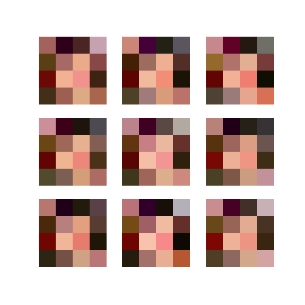
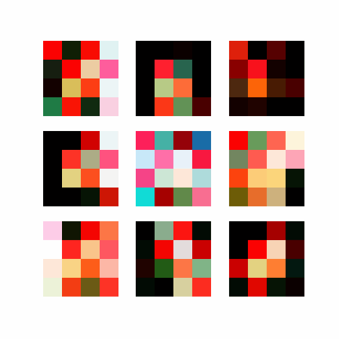
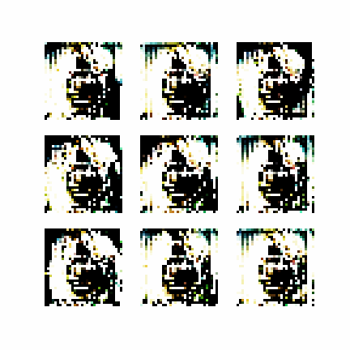
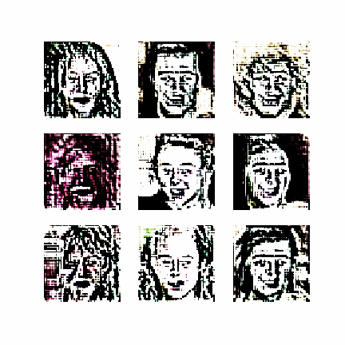

# PGGAN Tensorflow

This repo is the TF2.0 implementation of [Progressive Growing of GANs for Improved Quality, Stability, and Variation](https://arxiv.org/abs/1710.10196). 

Note that this implementation is not totally the same as the paper. There might be some differences.

**[Official implementation](https://github.com/tkarras/progressive_growing_of_gans)**

**[Google Colab](https://colab.research.google.com/drive/1SdfNdom68koJLdhl3wumjOOvPgfdBJV9?usp=sharing#scrollTo=LOsY-eRGT2wt)**

## Dataset

The notebook trains models using [CelebAMask-HQ](https://github.com/switchablenorms/CelebAMask-HQ) dataset. 

[Their paper](https://arxiv.org/abs/1907.11922)

## Environments

* Python 3
* jupyter or jupyterlab
* numpy
* matplotlib
* tensorflow 2.0

## How to Run

1. Download the dataset you want.

2. Clone this repo, then use Juypter Notebook or Lab to open the `PGGAN-Tensorflow.ipynb`     file, and modify the dataset path in the **Prepare dataset** section.

It takes me about 4~5 days to train from 4 x 4 to 128 x 128 resolution on single 1080ti GPU.
(Not continuious training)

## Training steps

The default setting is running on **Tensorflow eager** mode, this setting can support growing network, but the downside is the training speed. On the other hand, adding **tf function** decorator can almost double up the speed, however this setting doesn't work with auto growing network. Which means that when you want to train the next resolution model, you need to restart the notebook and adjust `image_size` and `CURRENT_EPOCH`.

For example, if the training of **64 x 64** model is finished and saved, and I want to train **128 x 128** model. I have to restart the notebook, adjust the `image_size` to **128**, and `CURRENT_EPOCH` to **201** (By default, 40 epochs for one resolution in this notebook)

## Trained Models

The model's code has been fixed, so the old 128x128 trained model wouldn't work.

[4 x 4](https://drive.google.com/file/d/1Ik00cF0xN_l7nUsmSxZgHR0YdIGhDkrY/view?usp=sharing)

[8 x 8](https://drive.google.com/file/d/1yHjHf0p3djt3O-8ezdO6q9Cyj0bVW1W5/view?usp=sharing)

[16 x 16](https://drive.google.com/file/d/1POBSffJBwh4oAkA3Ve0hkj5PrCo8NkAK/view?usp=sharing)

[32 x 32](https://drive.google.com/file/d/1sMIZk-iwzxeEsT2bOyyhR8hfXbNwCC_Q/view?usp=sharing)

## Results

4 x 4 resolution

8 x 8 resolution

16 x 16 resolution

32 x 32 resolution

64 x 64 resolution

128 x 128 resolution

## Key Modules

Please check [modules.md](./modules.md).

## Acknowledges

TKarras's PGGAN repository, https://github.com/tkarras/progressive_growing_of_gans
